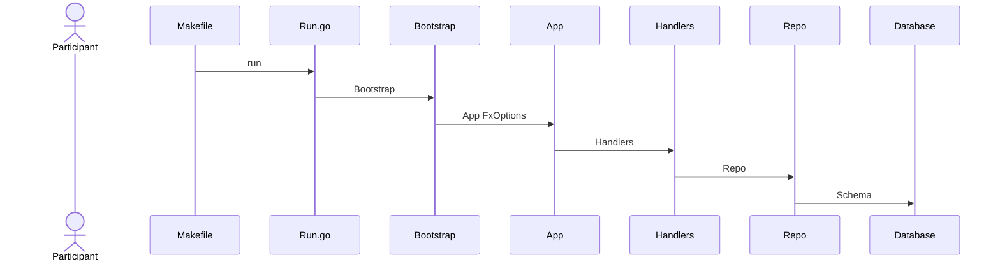

# Noah APIs

Noah APIs is using a microservice architecture, just for testing and learning.

## APIs Framework



## Install bufbuild/buf/buf

```bash
brew install bufbuild/buf/buf
```

## Generate

```bash
buf generate
```

## Install go-task

```bash
brew install go-task
```
